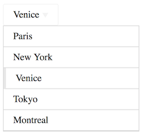

# How to use
Copy the code from **angular-dropdown.js** and **angular-dropdown.css** to your app.

Use the directive in your app
```html
<div dropdown model="..." options="..."></div>
```

```js
Attributes:
	model - data model
	options - options array [{ label : ..., value : ... }, { ... }]
```

# Example

