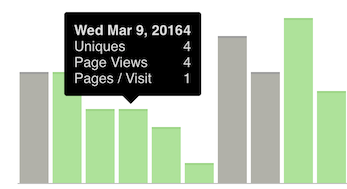

# How to use
Copy the code from **angular-tooltip.js** and **angular-tooltip.css** to your app.

Use the directive in your app
```html
<a tooltip title="The title of your link">click here</a>
```

```js
Attributes:
		title - element title
```

# Example

